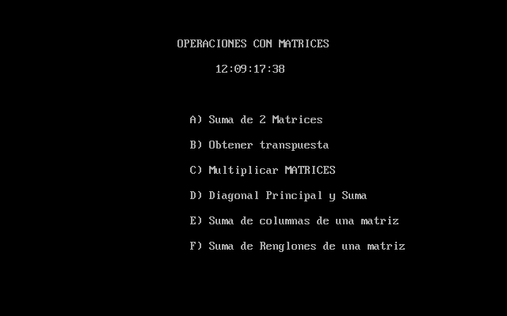

# x86 DOS Matrix Lab

Calculadora interactiva de matrices 4×4 escrita en ensamblador x86 de 16 bits
para DOS. El proyecto usa Turbo Assembler, interrupciones de BIOS/DOS, macros,
procedimientos públicos y el modelo de memoria `small`.

> **English summary:** An interactive 4×4 matrix calculator written in
> 16-bit x86 assembly for DOS. It demonstrates modular TASM code, BIOS/DOS
> interrupts, keyboard handling, numeric conversion and matrix algorithms.

## Demostración




## Funciones

- Suma de dos matrices.
- Matriz transpuesta.
- Multiplicación de matrices.
- Suma de la diagonal principal y de todos los elementos.
- Suma por columnas.
- Suma por renglones.
- Reloj en tiempo real mediante la interrupción `21h`.

## Tecnologías y conceptos

- Intel 80286, modo real de 16 bits.
- Turbo Assembler 4.1 y Turbo Linker.
- Interrupciones BIOS `10h` y DOS `21h`.
- Organización modular con macros, procedimientos y símbolos externos.
- Manejo manual de pila, registros, arreglos y conversión decimal/ASCII.

## Compilar y ejecutar

Requisitos:

- DOSBox 0.74-3 o compatible.
- Turbo Assembler (`TASM.EXE`) y Turbo Linker (`TLINK.EXE`) obtenidos
  legalmente. Estas herramientas no se distribuyen en el repositorio.

Monta el repositorio como unidad `C:` y la carpeta de TASM como `T:`:

```dos
mount c C:\ruta\x86-dos-matrix-lab
mount t C:\ruta\TASM
set PATH=%PATH%;T:\
c:
BUILD.BAT
RUN.BAT
```

`BUILD.BAT` ensambla ambos módulos y los enlaza directamente. Los archivos
generados quedan en `src/` y están excluidos de Git.

## Uso

El menú responde a las teclas `A`–`F`; `Esc` regresa o sale según la pantalla.
Cada matriz se introduce como **16 valores entre 0 y 9 separados por comas**:

```text
1,2,3,4,5,6,7,8,9,0,1,2,3,4,5,6
```

Los valores se interpretan por renglones. La restricción `0–9` mantiene los
resultados dentro de los formatos usados por la interfaz:

- valores y sumas parciales: dos dígitos;
- multiplicación y suma total: tres dígitos.

## Organización

```text
.
├── src/
│   ├── PROYECTO.ASM   # menú, interfaz y flujo principal
│   ├── PROCED.ASM     # algoritmos y conversión de datos
│   └── MACROS.INC     # macros de llamada y E/S
├── exercises/         # prácticas académicas complementarias
├── tests/             # casos de prueba reproducibles
├── BUILD.BAT
├── TEST.BAT
├── RUN.BAT
└── CLEAN.BAT
```

## Correcciones de la versión publicada

La versión de portafolio conserva el diseño original, con correcciones
verificables:

- escritura de un byte por elemento durante la lectura;
- multiplicación completa 4×4 con resultados de palabra sin solapamiento;
- conversión de productos de hasta tres dígitos;
- reinicio de acumuladores al repetir operaciones;
- impresión independiente de resultados escalares.

## Pruebas

`TEST.BAT` compila el proyecto y un arnés escrito también en ensamblador.
El arnés llama los procedimientos públicos y termina con código `0` solamente
si pasan los casos de lectura, suma, transposición, multiplicación, sumas
parciales, reinicio de acumuladores y conversión decimal:

```dos
TEST.BAT
```

Los datos y resultados esperados también están documentados en
[`tests/TEST-VECTORS.md`](tests/TEST-VECTORS.md).

## Alcance

Es un proyecto académico orientado a practicar ensamblador y arquitectura
x86. No pretende reemplazar una biblioteca matemática ni acepta números
negativos, fracciones o matrices de dimensiones variables.

## Autor

**Angel Emiliano Escobar Hernandez**
Proyecto académico de Estructura y Programación de Computadoras.

Distribuido bajo la [licencia MIT](LICENSE).
